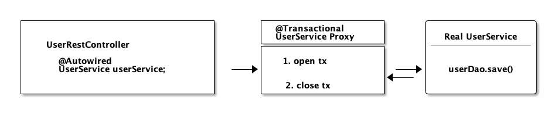
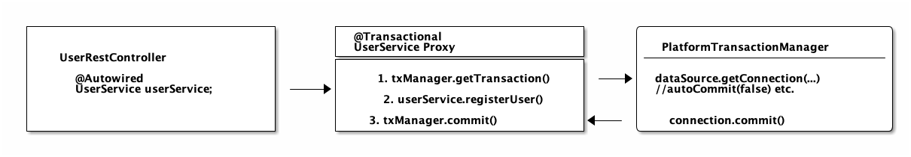
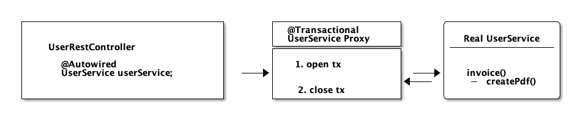
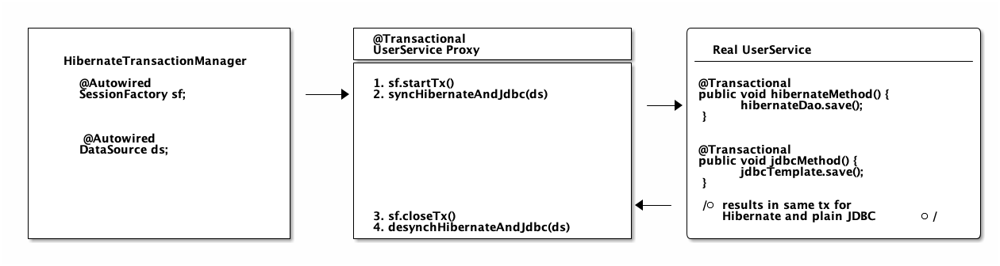

---

# 🌿 Spring Transaction Management — Clean Notes (based on Marco Behler’s guide)

> **Scope:** plain JDBC → Spring declarative (`@Transactional`) → transaction manager → proxies → JPA/Hibernate integration → nested transactions & savepoints → common pitfalls & best practices.
> Source reference: Marco Behler — *Spring Transaction Management: @Transactional In-Depth*. ([Marco Behler][1])

---

## 1. Core idea (TL;DR)

* A transaction is a unit of work that must satisfy **ACID**.
* At the lowest level (JDBC) transactions are started/committed/rolled back by manipulating a DB `Connection` (`setAutoCommit(false)`, `commit()`, `rollback()`). Spring’s `@Transactional` ultimately orchestrates these same steps for you. ([Marco Behler][1])

---

## 2. Plain JDBC: How plain JDBC Transaction Management works
> NOTE : The first important take-away is this: It does not matter if you are using Spring’s @Transactional annotation, plain Hibernate, jOOQ or any other database library.

**Mini code**

```java
import java.sql.Connection;
Connection connection = dataSource.getConnection(); // (1)
try (connection) {
    connection.setAutoCommit(false); // (2)
    // execute some SQL statements...
    connection.commit(); // (3)

} catch (SQLException e) {
    connection.rollback(); // (4)
}
```
* **1.Connect Database:** get `Connection` from `DataSource` and `connection.setAutoCommit(false)`.
* **2.Start a database transaction:** run SQL statements on that connection. setAutoCommit(true) makes sure that every single SQL statement automatically 
gets wrapped in its own transaction and setAutoCommit(false) is the opposite:
  >NOTE :  the autoCommit flag is valid for the whole time your connection is open, which means you only need to call the method once, not repeatedly.
* **3. or 4. Commit/rollback:** `connection.commit()` on success, `connection.rollback()` on exception.
* `Yes, above these 4 lines are (oversimplified) everything that Spring does whenever you are using the @Transactional annotation. `


**Thing to mind:** connection pooling (HikariCP, etc.) may toggle autocommit for you — be aware of pool behavior. ([Marco Behler][1])
### How to use JDBC isolation levels and savepoints
```java
@Transactional(propagation=TransactionDefinition.NESTED,isolation=TransactionDefinition.ISOLATION_READ_UNCOMMITTED)

```

>  ```java 
> INTERNAL WORK OF ABOVE TRANSACTION ANOTATION 
> 
        import java.sql.Connection;
        // isolation=TransactionDefinition.ISOLATION_READ_UNCOMMITTED
        connection.setTransactionIsolation(Connection.TRANSACTION_READ_UNCOMMITTED); // (1)
        // propagation=TransactionDefinition.NESTED
        Savepoint savePoint = connection.setSavepoint(); // (2)
        ...
        connection.rollback(savePoint);

      ```

`This is how Spring sets isolation levels on a database connection. 
Nested transactions in Spring are just JDBC / database savepoints.`

>Note : that savepoint support is dependent on your JDBC driver/database.
---
## 3. Spring transaction management — the high-level picture

* Spring provides **declarative** (`@Transactional`) and **programmatic** (`TransactionTemplate` / `PlatformTransactionManager`) approaches. Declarative is most common in modern apps. ([Marco Behler][1])
* To use `@Transactional`, enable transaction management (`@EnableTransactionManagement`) and expose a `PlatformTransactionManager` bean (Spring Boot auto-configures one for common setups). ([Marco Behler][1])

### How Spring’s or Spring Boot’s Transaction Management works
> **_Remember, transaction management simply means: How does Spring start, commit or rollback JDBC transactions_**

##### Here’s the catch: Whereas with plain JDBC you only have one way (setAutocommit(false)) to manage transactions, Spring offers you many different, more convenient ways to achieve the same

**Programmatic vs Declarative**

* **1. _Programmatic:_** `TransactionTemplate` — explicit callback-style handling but still simplifies JDBC.
     #### How to use Spring’s Programmatic Transaction Management?
    >The first, but rather sparingly used way to define transactions in Spring is programmatically: Either through a TransactionTemplate or directly through the PlatformTransactionManager. Code-wise, it looks like this:
          
```java
        @Service
        public class UserService {
        
            @Autowired
            private TransactionTemplate template;
        
            public Long registerUser(User user) {
                Long id = template.execute(status ->  {
                    // execute some SQL that e.g.
                    // inserts the user into the db and returns the autogenerated id
                    return id;
                });
            }
        }
        
        Compared with the plain JDBC example:
1. You do not have to mess with opening or closing database connections yourself (try-finally). Instead you use Transaction Callbacks.
2. You also do not have to catch SQLExceptions, as Spring converts these exceptions to runtime exceptions for you.
3. And you have better integration into the Spring ecosystem. TransactionTemplate will use a TransactionManager internally,
 which will use a data source. All are beans that you have to specify in your Spring context configuration,
  but then don’t have to worry about anymore later on.
   ```

* Declarative: `@Transactional` on public methods — Spring creates proxies that manage transactions automatically. ([Marco Behler][1])
  #### How to use Spring’s Declarative Transaction Management?
      * Earlier Issue wit XML Configuration :
           Back in the day, when XML configuration was the norm for Spring projects, you could configure transactions directly in XML. Apart from a couple of legacy,
           enterprise projects, you won’t find this approach anymore in the wild, as it has been superseded with the much simpler @Transactional annotation.
      * Example how actually used xml based transaction managment :
    ```xml
    <!-- the transactional advice (what 'happens'; see the <aop:advisor/> bean below) -->
        <tx:advice id="txAdvice" transaction-manager="txManager">
            <!-- the transactional semantics... -->
            <tx:attributes>
                <!-- all methods starting with 'get' are read-only -->
                <tx:method name="get*" read-only="true"/>
                <!-- other methods use the default transaction settings (see below) -->
                <tx:method name="*"/>
            </tx:attributes>
        </tx:advice>
    ```
  You are specifying an AOP advice (Aspect Oriented Programming) with the above XML block, that you can then apply to your UserService bean like so:
    ```xml
    <aop:config>
        <aop:pointcut id="userServiceOperation" expression="execution(* x.y.service.UserService.*(..))"/>
        <aop:advisor advice-ref="txAdvice" pointcut-ref="userServiceOperation"/>
    </aop:config>
    
    <bean id="userService" class="x.y.service.UserService"/>
    ```

  Your UserService bean would then look like this:
```java
  public class UserService {
    public Long registerUser(User user) {
        // execute some SQL that e.g.
        // inserts the user into the db and retrieves the autogenerated id
        return id;
    }
  }
```
>   SOLUTION :  for the above verbose XML is DECLARATIVE TRANSACTION MANAGMENT USING @Transaction 

      There is no more XML configuration and there’s also no other code needed. Instead, you now need to do two things:
      1. Make sure that your Spring Configuration is annotated with the @EnableTransactionManagement annotation (In Spring Boot this will be done automatically for you).
      2. Make sure you specify a transaction manager in your Spring Configuration (this you need to do anyway).


```java
    --------------------------------------------------------
    @Configuration
    @EnableTransactionManagement
    public class MySpringConfig {
    
        @Bean
        public PlatformTransactionManager txManager() {
            return yourTxManager; // more on that later
        }
    
    }
    
    ------------------------------------------------------
    
    SIMPLIFIED VERSION OF ABOVE : 
    @Transactional UserService code above translates (simplified) directly to this:
    
    
    public class UserService {
    public Long registerUser(User user) {
        Connection connection = dataSource.getConnection(); // (1)
        try (connection) {
            connection.setAutoCommit(false); // (1)

            // execute some SQL that e.g.
            // inserts the user into the db and retrieves the autogenerated id
            // userDao.save(user); <(2)

            connection.commit(); // (1)
        } catch (SQLException e) {
            connection.rollback(); // (1)
        }
    }
  }
    
   ```
---

## 4. How `@Transactional` works under the hood (proxies + transaction manager) 
### Internal working of the CGlib & JDK Proxies
points : 
> 1. Spring cannot really rewrite your Java class, like I did above, to insert the connection code
> 2. our registerUser() method really just calls userDao.save(user), there’s no way to change that on the fly
> 3. But Spring has an advantage. At its core, it is an IoC container. It instantiates a UserService for you and makes sure to autowire that UserService into any other bean that needs a UserService.
> 4. Now whenever you are using @Transactional on a bean, Spring uses a tiny trick. It does not just instantiate a UserService, but also a transactional proxy of that UserService.
     It does that through a method called proxy-through-subclassing with the help of the Cglib library. There are also other ways to construct proxies (like Dynamic JDK proxies), but let’s leave it at that for the moment.

> 5. As you can see from that diagram, the proxy has one job.

>    1. Opening and closing database connections/transactions.
>    2. And then delegating to the real UserService, the one you wrote.
>    3. And other beans, like your UserRestController will never know that they are talking to a proxy, and not the real thing.


1. Spring creates a **proxy** around your bean (CGLIB subclassing or JDK dynamic proxies). The proxy intercepts calls to transactional methods. ([Marco Behler][1])
2. The proxy delegates transaction lifecycle work to a **PlatformTransactionManager** (e.g., `DataSourceTransactionManager`): begin, commit, rollback. ([Marco Behler][1])
3. The transaction manager internally obtains a `Connection` and sets `autoCommit(false)` and later commits/rollbacks — exactly the same steps you would write in plain JDBC. ([Marco Behler][1])

**Visual mental model:** Caller → Proxy → TransactionManager (begin) → Real bean method → TransactionManager (commit/rollback) → Caller.

**Things to mind**

* Proxies only intercept external calls into the proxied bean — *self-invocation* (a method in the same class calling another `@Transactional` method) bypasses the proxy and thus the transaction. ([Marco Behler][1])
  * If you declare a `@Bean` returning your service, Spring will still wrap with a proxy if transactional behavior is detected (CGLIB by default in many cases). ([Marco Behler][1])

Quick Exam

>Have a look at the following source code and tell me what type of UserService Spring automatically constructs, assuming it is marked with @Transactional or has a @Transactional method.
  
  ```java 
  @Configuration
      @EnableTransactionManagement
      public static class MyAppConfig {
    
          @Bean
          public UserService userService() {  // (1)
              return new UserService();
          }
      }
   ```
> Answer. Spring constructs a dynamic CGLib proxy of your UserService class here that can open and close database transactions for you. You or any other beans won’t even notice that it is not your UserService, but a proxy wrapping your UserService.
    
---

## 5. WHY do you need a Transaction Manager (like PlatformTransactionManager)?
Points 
> 1. Your UserService gets proxied on the fly, and the proxy manages transactions for you. 
> 2. But it is not the proxy itself handling all this transactional state (open, commit, close), the proxy delegates that work to a transaction manager.
> 3. Spring offers you a PlatformTransactionManager / TransactionManager interface, which, by default, comes with a couple of handy implementations. One of them is the datasource transaction manager.
     It does exactly what you did so far to manage transactions, but first, let’s look at the needed Spring configuration:
  ```java
      @Bean
      public DataSource dataSource() {
          return new MysqlDataSource(); // (1) create a database-specific or connection-pool specific datasource here. MySQL is being used for 
      }
      
      @Bean
      public PlatformTransactionManager txManager() {
          return new DataSourceTransactionManager(dataSource()); // (2)  create your transaction manager, which needs a data source to be able to manage transactions.
      }
  ```
>4. Simple as. All transaction managers then have methods like "doBegin" (for starting a transaction) or "doCommit", which look like this - taken straight from Spring’s source code and simplified a bit:
  ```java
   public class DataSourceTransactionManager implements PlatformTransactionManager {
  
      @Override
      protected void doBegin(Object transaction, TransactionDefinition definition) {
          Connection newCon = obtainDataSource().getConnection();
          // ...
          con.setAutoCommit(false);
          // yes, that's it!
      }
  
      @Override
      protected void doCommit(DefaultTransactionStatus status) {
          // ...
          Connection connection = status.getTransaction().getConnectionHolder().getConnection();
          try {
              con.commit();
          } catch (SQLException ex) {
              throw new TransactionSystemException("Could not commit JDBC transaction", ex);
          }
      }
  }
  ```
So, the datasource transaction manager uses exactly the same code that you saw in the JDBC section, when managing transactions.


   

### **To sum things up:**
>        1. If Spring detects the @Transactional annotation on a bean, it creates a dynamic proxy of that bean.
>        2. The proxy has access to a transaction manager and will ask it to open and close transactions / connections.
>        3. The transaction manager itself will simply do what you did in the plain Java section: Manage a good, old JDBC connection


* `PlatformTransactionManager` is the abstraction (Spring). Common concrete implementations:

    * `DataSourceTransactionManager` (JDBC) — manages JDBC `Connection`s and `commit/rollback`. ([Marco Behler][1])
    * `JpaTransactionManager` — integrates Spring with JPA providers (EntityManager).
    * Others: `JtaTransactionManager` for XA/distributed transactions.
* The manager implements `doBegin`, `doCommit`, `doRollback` — these map to `getConnection()`, `setAutoCommit(false)`, `commit()`/`rollback()`. ([Marco Behler][1])

**Quick config snippet**

```java
@Bean
public PlatformTransactionManager txManager(DataSource ds) {
    return new DataSourceTransactionManager(ds);
}
```

---


# 🔹 Physical vs Logical Transactions in Spring
* **Physical transaction:** the actual DB transaction (JDBC `Connection` + `autoCommit` state).
* **Logical transaction:** Spring’s notion of a transaction scope (e.g., propagation semantics may create nested/logical transactions that map to the same/different physical transaction depending on propagation settings).
* Example: `REQUIRES_NEW` creates a new physical transaction (suspends the current one), whereas `REQUIRED` usually joins the existing logical (and physical) transaction. ([Marco Behler][1])

## 1. Physical Transaction

* **Definition:** The actual **JDBC/database transaction** happening under the hood.
* It’s what you would write in plain JDBC:

  ```java
  connection.setAutoCommit(false);
  // SQL statements
  connection.commit();
  ```
* Always tied to a **database connection**.
* There is **no such thing** as “nested” physical transactions in JDBC.

---

## 2. Logical Transaction

* **Definition:** Each method annotated with `@Transactional` in Spring is considered a **logical transaction**.
* One physical transaction can contain **multiple logical transactions**.
* Spring maps logical transactions to physical ones using **transaction propagation rules**.

---

## 3. Example Without `REQUIRES_NEW`

```java
@Service
public class UserService {

    @Autowired
    private InvoiceService invoiceService;

    @Transactional
    public void invoice() {
        invoiceService.createPdf();
        // send invoice as email, etc.
    }
}

@Service
public class InvoiceService {

    @Transactional
    public void createPdf() {
        // ...
    }
}
```
Which basically means your code will open two (physical) connections/transactions to the database.
(Again: getConnection() x2. setAutocommit(false) x2. commit() x2) 
Spring now has to be smart enough that the two logical transactional pieces (invoice()/createPdf()) now also map to two different, physical database transactions.
* **UserService.invoice()** → 1 logical transaction.
* **InvoiceService.createPdf()** → another logical transaction.
* Spring is smart enough to **reuse the same physical transaction**.

  * ✅ So **only one physical JDBC transaction** is opened.

---

## 4. Example With `REQUIRES_NEW`

```java
@Service
public class InvoiceService {

    @Transactional(propagation = Propagation.REQUIRES_NEW)
    public void createPdf() {
        // ...
    }
}
```

* **UserService.invoice()** runs in its **own transaction**.
* **InvoiceService.createPdf()** starts a **new independent transaction**.
* 👉 Now Spring opens **two separate physical transactions**:

  * 1 for `invoice()`
  * 1 for `createPdf()`
* Each transaction gets its own **database connection, commit/rollback** cycle.

---

## 5. Key Takeaways

* **Physical Transaction:** The real JDBC transaction (can’t be split).
* **Logical Transaction:** The `@Transactional` methods managed by Spring.
* By default, multiple logical transactions share the **same physical transaction**.
* If `Propagation.REQUIRES_NEW` is used → A **new physical transaction** is created.

---

✅ **In Interviews, you can say:**

* Logical = Spring concept (methods annotated with `@Transactional`).
* Physical = Database concept (real transaction at JDBC level).
* Propagation decides how logical transactions map to physical ones.

1. **_`Required`_** (**default**): My method needs a transaction, either open one for me or use an existing one → getConnection(). setAutocommit(false). commit().
2. **_`Supports`_**: I don’t really care if a transaction is open or not, i can work either way → nothing to do with JDBC
3. **_`Mandatory`_**: I’m not going to open up a transaction myself, but I’m going to cry if no one else opened one up → nothing to do with JDBC
4. **_`Require_new`_**: I want my completely own transaction → getConnection(). setAutocommit(false). commit().
5. **_`Not_Supported`_**: I really don’t like transactions, I will even try and suspend a current, running transaction → nothing to do with JDBC
6. **_`Never`_**: I’m going to cry if someone else started up a transaction → nothing to do with JDBC
7. `Nested:` It sounds so complicated, but we are just talking savepoints! → connection.setSavepoint()


| Propagation Mode       | Meaning                                                                                                     | Physical Transaction Behavior                                                             | Practical Use Case                                                                                                             |
| ---------------------- | ----------------------------------------------------------------------------------------------------------- | ----------------------------------------------------------------------------------------- | ------------------------------------------------------------------------------------------------------------------------------ |
| **REQUIRED** (default) | If a transaction exists → join it. If not → start a new one.                                                | Shares the **same physical transaction**.                                                 | ✅ Most common case. Example: `UserService` calls `InvoiceService`. Both should succeed or fail together.                       |
| **REQUIRES\_NEW**      | Always start a new transaction, suspending the existing one.                                                | Opens a **new physical transaction**.                                                     | Example: Logging/Audit service. Even if main transaction fails, logs should still be saved.                                    |
| **SUPPORTS**           | If a transaction exists → join it. If not → run without transaction.                                        | Optional transaction, doesn’t force one.                                                  | Example: Read-only queries (like `findById`) that may or may not be inside a transaction.                                      |
| **MANDATORY**          | Must run inside an existing transaction. If none → throw exception.                                         | No new transaction created.                                                               | Example: Low-level DAO methods that should only be called from within a service method that already has a transaction.         |
| **NOT\_SUPPORTED**     | Run **without** a transaction. If one exists → suspend it.                                                  | No transaction.                                                                           | Example: Non-transactional operations like sending emails, notifications.                                                      |
| **NEVER**              | Must run **without** a transaction. If one exists → throw exception.                                        | No transaction.                                                                           | Example: Methods that must never run inside a transaction, e.g., when dealing with legacy APIs that can’t handle transactions. |
| **NESTED**             | If a transaction exists → run in a **nested transaction** (with savepoint). If not → behaves like REQUIRED. | Nested transaction uses savepoints (rollback only inner part). Needs JDBC driver support. | Example: A batch job where failure in one record should roll back only that record, not the whole batch.                       |

---

# 🔹 Code Examples

### 1. REQUIRED (default)

```java
@Transactional
public void placeOrder() {
    paymentService.charge();
    inventoryService.reduceStock();
}
```

👉 If `reduceStock()` fails, `charge()` is rolled back too.

---

### 2. REQUIRES\_NEW

```java
@Transactional
public void placeOrder() {
    paymentService.charge();
    auditService.logOrder(); // REQUIRES_NEW
}
```

👉 Even if `charge()` fails, `logOrder()` is committed because it runs in a **separate physical transaction**.

---

### 3. SUPPORTS

```java
@Transactional(propagation = Propagation.SUPPORTS, readOnly = true)
public List<Product> getProducts() {
    return productRepository.findAll();
}
```

👉 Works with or without a transaction. Efficient for reads.

---

### 4. MANDATORY

```java
@Transactional(propagation = Propagation.MANDATORY)
public void updateInvoice() {
    // must be called inside another transaction
}
```

👉 If called without a transaction → Spring throws exception.

---

### 5. NOT\_SUPPORTED

```java
@Transactional(propagation = Propagation.NOT_SUPPORTED)
public void sendEmail() {
    // should not be wrapped in DB transaction
}
```

---

### 6. NEVER

```java
@Transactional(propagation = Propagation.NEVER)
public void externalApiCall() {
    // fail if already inside a transaction
}
```

---

### 7. NESTED

```java
@Transactional
public void processBatch() {
    for (Order order : orders) {
        try {
            processOrder(order); // NESTED
        } catch (Exception e) {
            // rollback only this order (savepoint rollback)
        }
    }
}
```

👉 Useful for **partial rollbacks**.

---

# 🔹 Key Interview Points

1. **REQUIRED vs REQUIRES\_NEW** → Most frequently asked.

  * REQUIRED → join same transaction.
  * REQUIRES\_NEW → new independent transaction.
2. **NESTED** needs JDBC savepoint support (not all DBs support).
3. **MANDATORY** & **NEVER** are stricter, used rarely.
4. **SUPPORTS** & **NOT\_SUPPORTED** mostly for read-only or non-transactional ops.

---

👉 Would you like me to also create a **diagram that visually shows how REQUIRED, REQUIRES\_NEW, and NESTED differ** (stack-like view of transactions)? That helps in quick recall during interviews.

* Spring’s `Propagation.NESTED` uses **JDBC savepoints** where supported: the outer transaction continues, but inner failures can roll back to a savepoint without aborting the outer transaction. Savepoint support depends on the DB/driver. ([Marco Behler][1])
**Mini JDBC mapping**
```java
connection.setTransactionIsolation(...); // isolation level
Savepoint sp = connection.setSavepoint();
// ... rollback(sp)
```
**Thing to mind:** Not all DBs/drivers support savepoints; nested semantics differ from `REQUIRES_NEW`.

---


---

## 7. What are @Transactional Isolation Levels used for?
### 1. What it does
When you configure:
```java
@Transactional(isolation = Isolation.REPEATABLE_READ)
```
👉 Spring translates it to:
```java
connection.setTransactionIsolation(Connection.TRANSACTION_REPEATABLE_READ);
```
So the **actual isolation** is enforced by the **database** (JDBC driver + DB engine), not by Spring.

### 2. Standard Isolation Levels (ANSI SQL)

| Isolation Level                           | What It Prevents                                 | Still Allows                                     | Example Issue Prevented                                |
| ----------------------------------------- | ------------------------------------------------ | ------------------------------------------------ | ------------------------------------------------------ |
| **READ\_UNCOMMITTED**                     | Nothing                                          | Dirty reads, Non-repeatable reads, Phantom reads | Worst isolation (rarely used).                         |
| **READ\_COMMITTED** (default in many DBs) | Dirty reads                                      | Non-repeatable reads, Phantom reads              | Ensures only committed data is read.                   |
| **REPEATABLE\_READ** (default in MySQL)   | Dirty reads, Non-repeatable reads                | Phantom reads                                    | Same row read multiple times gives consistent results. |
| **SERIALIZABLE**                          | Dirty reads, Non-repeatable reads, Phantom reads | Nothing                                          | Strictest level, but slowest (rows locked).            |

✅ Tip: Mention Postgres/MySQL defaults in interviews.

### 3. Key Considerations

* Changing isolation level mid-transaction may not be supported by all DBs.
* Always check **your JDBC driver + database docs**.
* Use stricter levels **only when necessary**, since they hurt performance.

### 🔹 Common Pitfall: Self-Invocation in Spring Proxies
### Example

```java
@Service
public class UserService {

    @Transactional
    public void invoice() {
        createPdf(); // self-invocation
    }

    @Transactional(propagation = Propagation.REQUIRES_NEW)
    public void createPdf() {
        // ...
    }
}
```

### What you expect

* `invoice()` starts **one transaction**.
* `createPdf()` with `REQUIRES_NEW` should start another transaction
*  So you might think there are **two physical transactions**.
* 
  Nope, the answer is not two, but one. Why?
Let’s go back to the proxies' section of this guide. Spring creates that transactional UserService proxy for you, but once you are inside the UserService class and call other inner methods, there is no more proxy involved. This means, no new transaction for you.
Let’s have a look at it with a picture:
  
* 
### What really happens
There’s some tricks (like self-injection), which you can use to get around this limitation. But the main takeaway is: always keep the proxy transaction boundaries in mind.
* Spring creates a **proxy** for `UserService`.
* `@Transactional` works **only when methods are called through the proxy**.
* But here `createPdf()` is called **inside the same class** (direct method call).
* This bypasses the proxy → **no new transaction** is started.
* Result: only **one physical transaction**.

### ✅ Solutions (Workarounds)

1. **Self-injection**

```java
@Autowired
private UserService self;

@Transactional
public void invoice() {
    self.createPdf(); // goes through proxy
}
```

2. **Move method to another @Service class**
  * Makes proxy boundaries clear.
3. **AOP-aware utilities**
  * Use `AopContext.currentProxy()` if enabled (`exposeProxy=true`).


# 🔹 Interview Key Takeaways

1. **Isolation levels** → Spring just delegates to DB via JDBC.
2. **READ\_COMMITTED vs REPEATABLE\_READ vs SERIALIZABLE** are most asked.
3. **Self-invocation issue** → most common beginner pitfall.
4. Transactional only works **across proxies**, not within same class calls.
5. Always mention: "Spring manages **logical transactions**, DB handles **physical transactions**."

How to use @Transactional with Spring Boot or Spring MVC
> Note : The only difference with Spring Boot is, however, that it automatically sets the @EnableTransactionManagement annotation and creates a PlatformTransactionManager for you - with its JDBC auto-configurations.

###  Key `@Transactional` attributes (what to use when)

* `propagation` — how to behave when an existing transaction is present:
* `REQUIRED` (default), `REQUIRES_NEW`, `NESTED`, `SUPPORTS`, `NOT_SUPPORTED`, `MANDATORY`, `NEVER`. ([Marco Behler][1])
* `isolation` — DB isolation levels: `DEFAULT`, `READ_UNCOMMITTED`, `READ_COMMITTED`, `REPEATABLE_READ`, `SERIALIZABLE`. Maps directly to `Connection#setTransactionIsolation`. ([Marco Behler][1])
* `timeout` — seconds before rollback.
* `readOnly` — optimization hint for DB and ORM.
* `rollbackFor` / `noRollbackFor` — override default rollback behavior (by default, Spring rolls back on runtime exceptions only).

---

The reason the ** integration (Spring @Transactional + HibernateTransactionManager/JpaTransactionManager)** is required is:


### 1. **Problem Without Integration**

* If you just use **plain Hibernate** → you manually call:

  * `openSession()`
  * `beginTransaction()`
  * `commit()`
  * `close()`
* If you just use **Spring’s @Transactional** → Spring manages the transaction lifecycle for you.
* But:
  👉 Hibernate and Spring don’t know about each other’s transactions.

  * Spring may think a transaction is running, but Hibernate might open another one.
  * Or Hibernate commits while Spring thinks it should still roll back.
    ❌ This leads to inconsistencies, duplicate commits, or rollback failures.

### 2. **Goal**

We want **both Spring and Hibernate to “talk” in the same transaction context**, so:

* Spring’s `@Transactional` drives the transaction boundaries.
* Hibernate’s `Session` and `Transaction` participate in the same transaction.

### 3. **Solution**

Use Spring’s **HibernateTransactionManager** (or `JpaTransactionManager` if using JPA).

* This manager:

  * Hooks into Hibernate’s `SessionFactory`.
  * Makes sure Hibernate’s session and Spring’s transaction synchronization are aligned.
  * Allows other Spring-managed components (like JDBC calls, JPA repositories, etc.) to join the same transaction.

### 4. **In Simple Words**

Think of it like this:

* Without it → **Spring and Hibernate drive two different cars** on two different roads.
* With `HibernateTransactionManager` → **Spring drives the car, and Hibernate just sits in the same car**.
  So only **one transaction** is running, managed consistently.

---

👉 That’s why this integration is **required**: to ensure **transaction consistency, less boilerplate, and correct rollback/commit behavior across Spring and Hibernate/JPA**.

# 🔹 How Spring and JPA / Hibernate Transaction Management Works

## 🎯 The Goal

Syncing Spring’s `@Transactional` and Hibernate / JPA.
At some point, you will want your Spring application to integrate with another database library, such as Hibernate (a popular JPA-implementation) or Jooq etc.

## 🔹 Example with Plain Hibernate

```java
public class UserService {

    @Autowired
    private SessionFactory sessionFactory; // (1)

    public void registerUser(User user) {

        Session session = sessionFactory.openSession(); // (2)

        // lets open up a transaction. remember setAutocommit(false)!
        session.beginTransaction();

        // save == insert our objects
        session.save(user);

        // and commit it
        session.getTransaction().commit();

        // close the session == our jdbc connection
        session.close();
    }
}
```

* This is a plain, old Hibernate `SessionFactory`, the entry-point for all Hibernate queries.
* Manually managing sessions (read: database connections) and transactions with Hibernate’s API.


## 🔹 The Problem

There is one huge problem with the above code, however:

* Hibernate would not know about Spring’s `@Transactional` annotation.
* Spring’s `@Transactional` would not know anything about Hibernate’s transaction.
* But we’d actually love for Spring and Hibernate to integrate seamlessly, meaning that they know about each others' transactions.


## 🔹 Integration with @Transactional

```java
@Service
public class UserService {

    @Autowired
    private SessionFactory sessionFactory; // (1)

    @Transactional
    public void registerUser(User user) {
        sessionFactory.getCurrentSession().save(user); // (2)
    }
}
```

* The same `SessionFactory` as before.
* But no more manual state management.
* Instead, `getCurrentSession()` and `@Transactional` are in sync.

## 🔹 How to Get There?

👉 Using the **HibernateTransactionManager**

There is a very simple fix for this integration problem:

* Instead of using a `DataSourcePlatformTransactionManager` in your Spring configuration, you will be using a **HibernateTransactionManager** (if using plain Hibernate) or **JpaTransactionManager** (if using Hibernate through JPA).


## 🔹 What HibernateTransactionManager Does

The specialized `HibernateTransactionManager` will make sure to:

1. Manage transactions through Hibernate, i.e. the `SessionFactory`.
2. Be smart enough to allow Spring to use that very same transaction in non-Hibernate, i.e. `@Transactional` Spring code.
3. the flow between the proxy and real service is only conceptually right and oversimplified).


## 🔹 Summary

That is, in a nutshell, how you integrate Spring and Hibernate.

For other integrations or a more in-depth understanding, it helps to have a quick look at all possible `PlatformTransactionManager` implementations that Spring offers.

---


---

## 8. Common pitfalls & how to avoid them (interview favorites)

* **Self-invocation:** method A calls method B within same class; if B is `@Transactional`, proxy is bypassed → transaction NOT applied. *Fix:* extract to separate bean or call via proxy. ([Marco Behler][1])
* **Private or final methods:** proxying may not work (JDK proxy needs interface; CGLIB can't proxy final methods).
* **Checked exceptions:** by default, Spring commits on checked exceptions — use `rollbackFor` if you want rollback on checked exceptions.
* **LazyInitializationException:** accessing lazy-loaded associations outside transaction boundaries fails. Keep fetches inside transactional scope or DTO-ify results.
* **Long transactions:** don’t do heavy CPU work or blocking I/O inside transactions — keep them short for throughput.
* **Mixing readOnly and write** — `readOnly=true` is a hint; don’t rely on it to prevent writes.

---

## 10. Best practices (practical checklist)

* Put `@Transactional` on **service layer** public methods — not on controllers or repository internals.
* Keep transactions **short and focused** (DB ops only).
* Explicitly set propagation/isolation only when you need non-default behavior.
* Use integration tests to verify rollback behavior.
* For `self-invocation` problems, move transactional methods to different beans or use `AopContext.currentProxy()` carefully.
* Prefer `REQUIRED` unless you truly need `REQUIRES_NEW` or savepoints.

---

## 11. Example scenarios (short)

* **Transfer money:** `@Transactional` on `transfer()` to ensure both debit & credit occur atomically.
* **Audit log + domain update:** if you need the audit saved irrespective of the main transaction outcome, use `REQUIRES_NEW` for audit so it commits even if main tx rolls back.
* **Nested operation with rollback to savepoint:** use `NESTED` when you want inner operation failures not to abort outer transaction (if DB supports savepoints).

---

## 12. Interview cheat-sheet (one-liners to say)

* `@Transactional` uses **AOP proxies** and `PlatformTransactionManager` to manage JDBC transactions (begin/commit/rollback). ([Marco Behler][1])
* Default propagation is **REQUIRED**; default rollback is on **RuntimeException**. ([Marco Behler][1])
* `REQUIRES_NEW` suspends the current transaction and starts a new physical transaction. `NESTED` uses savepoints (DB dependent). ([Marco Behler][1])
* Self-invocation bypasses proxy — move transactional methods to another bean to ensure proxy interception. ([Marco Behler][1])

---

## 13. Short reading path on the original guide

If you want the exact deep-dive ordering Marco uses (recommended):

1. JDBC basics (to understand `setAutoCommit`, `commit`, `rollback`) → lines about the JDBC example. ([Marco Behler][1])
2. Programmatic transaction management (`TransactionTemplate`) → then declarative via `@Transactional`. ([Marco Behler][1])
3. Proxies + PlatformTransactionManager internals (how `doBegin`/`doCommit` work). ([Marco Behler][1])

---
Great question 👌 Let’s make **proxy** super simple.

---

# 🔹 What is a Proxy?

👉 **A proxy is like a middleman object that wraps the real object and controls access to it.**
In Spring, proxies are created automatically (using JDK dynamic proxies or CGLIB) to add extra behavior — like **transactions, logging, or security** — around your methods.

---

## 🎯 Real-Life Analogy

Imagine you want to talk to a celebrity:

* You don’t talk directly to them.
* You go through their **manager (proxy)** who decides:

  * Should you be allowed to meet them?
  * What conditions apply?
  * Maybe adds some extra rules (e.g., no photos).

👉 The celebrity = **real object**
👉 The manager = **proxy**

---

## 🖥️ In Spring

Without proxy:

```java
userService.createUser(); // direct call
```

With proxy:

```java
proxyOfUserService.createUser(); 
// proxy starts transaction, calls real createUser(), commits/rolls back transaction
```

So the proxy adds **extra behavior before/after** the real method runs.

---

## 📌 Why Spring Uses Proxies?

* To apply **cross-cutting concerns** without changing your code.
* Examples:

  * `@Transactional` → proxy starts/commits/rolls back transaction.
  * `@Cacheable` → proxy checks cache before calling method.
  * `@Secured` → proxy checks security rules.

---

## ⚡ Key Interview Takeaway

> A **proxy** in Spring is an object that wraps your bean and intercepts method calls to add extra logic (like transactions, logging, or security) **without changing your code**.

---

Perfect 👍 Let’s make a **tiny plain Java demo** so you understand what Spring is doing behind the scenes with proxies.

---

# 🔹 Example Without Proxy

```java
class UserService {
    public void createUser() {
        System.out.println("User created in DB");
    }
}

public class Main {
    public static void main(String[] args) {
        UserService service = new UserService();
        service.createUser(); // direct call
    }
}
```

👉 Output:

```
User created in DB
```

---

# 🔹 Example With a Manual Proxy

We wrap the `UserService` with a **proxy class** that adds extra logic (like a transaction).

```java
// The real service
class UserService {
    public void createUser() {
        System.out.println("User created in DB");
    }
}

// A proxy that wraps UserService
class UserServiceProxy {
    private UserService userService;

    public UserServiceProxy(UserService userService) {
        this.userService = userService;
    }

    public void createUser() {
        System.out.println("[Proxy] Begin Transaction");
        try {
            userService.createUser(); // delegate to real object
            System.out.println("[Proxy] Commit Transaction");
        } catch (Exception e) {
            System.out.println("[Proxy] Rollback Transaction");
        }
    }
}

public class Main {
    public static void main(String[] args) {
        UserService realService = new UserService();
        UserServiceProxy proxy = new UserServiceProxy(realService);

        proxy.createUser(); // call goes through proxy
    }
}
```

👉 Output:

```
[Proxy] Begin Transaction
User created in DB
[Proxy] Commit Transaction
```

---

# 🔹 What Spring Does

* Spring generates a proxy (using **JDK Dynamic Proxy** or **CGLIB**) around your `@Service` bean.
* When you call a method:

  * Proxy starts a transaction.
  * Calls the real object’s method.
  * Commits or rolls back based on result.

---

✅ So, **Spring’s @Transactional is nothing magical** — it’s just a **proxy adding transaction management logic before and after your real method**.

---

Do you want me to also show you the **dynamic proxy version** using Java’s `InvocationHandler` (which is closer to how Spring actually does it)?

---

If you want, I can now:

* convert the above into a **1-page printable cheat-sheet PDF**, or
* create **3–4 interview mock Q\&A** flashcards from these notes (with answers), or
* create a **diagram** showing proxy → txManager → connection flow.

Which of those would you like next?

[1]: https://www.marcobehler.com/guides/spring-transaction-management-transactional-in-depth "Spring Transaction Management: @Transactional In-Depth"


### POST Request

```
curl -X 'POST' \
  'http://localhost:9191/api/orders' \
  -H 'accept: */*' \
  -H 'Content-Type: application/json' \
  -d '{
  "id": 103,
  "productId": 1,
  "quantity": 5
}'
```
### PRODUCT DB SQL
```
INSERT INTO Product (name,price,stockQuantity) VALUES
	 ('Laptop',25000.0,10),
	 ('Samrtphone',5000.0,12);
```
